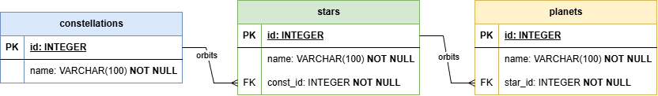

# 🔭 Проект: Веб-приложение "Планетарий"

Учебный проект по разработке веб-приложения на базе FastAPI для управления астрономическими данными.

## ✅ Выполненные требования (Чек-лист)
- [x] **Проектирование БД**: Создана база данных SQLite, соответствующая предметной области "Планетарий".
- [x] **Связанные таблицы**: Реализованы 3 связанные таблицы: `constellations` (созвездия) -> `stars` (звезды) -> `planets` (планеты).
- [x] **SQL-запросы**: Реализовано автоматическое создание и заполнение таблиц SQL-запросами при первом запуске.
- [x] **FastAPI**: Инициализировано приложение и настроены маршруты.
- [x] **Соединение с БД**: Настроено стабильное подключение через библиотеку `sqlite3`.
- [x] **Endpoints**: Определены эндпоинты для получения данных (JSON) и добавления записей (POST) для всех таблиц.
- [x] **Jinja2**: Создан динамический интерфейс на основе шаблонов Jinja2.
- [x] **HTML-формы**: Реализованы формы для создания новых записей во всех таблицах.
- [x] **XML DOM**: Осуществлен экспорт и импорт таблицы созвездий в формате XML с использованием DOM-модели.

## 🏗 Архитектура базы данных (ER-диаграмма)

Для обеспечения целостности данных и нормализации была спроектирована следующая схема:



* **constellations** (Созвездия) — базовая сущность.
* **stars** (Звезды) — связаны с созвездиями через внешний ключ `const_id`.
* **planets** (Планеты) — привязаны к конкретной звездной системе через `star_id`.

> Использование ограничений `NOT NULL` и связей `FOREIGN KEY` на уровне БД гарантирует отсутствие "сиротских" записей (например, планеты без звезды).

## 🛠 Технологический стек
* **Язык**: Python 3.10+
* **Фреймворк**: FastAPI
* **Шаблонизатор**: Jinja2
* **База данных**: SQLite3
* **XML Парсер**: xml.dom.minidom (DOM-модель)
* **Frontend**: HTML5, CSS3, JavaScript

##

## 🚀 Инструкция по запуску

Для запуска проекта на локальном компьютере выполните следующие шаги:

### 0. Клонирование репозитория
```bash
git clone https://github.com/QIBIK/planetarium.git
cd planetarium
```

### 1. Подготовка окружения
Создайте виртуальное окружение, чтобы зависимости проекта не конфликтовали с системными:
```bash
# Для Windows
python -m venv .venv
.venv\Scripts\Activate.ps1
```

### 2. Установка зависимостей
```bash
pip install -r requirements.txt
```

### 3. Запуск
```bash
uvicorn main:app --reload
```
